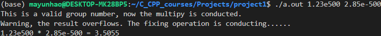
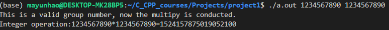
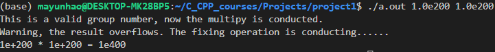

# **CS205 C/ C++ Program Design - Project 1**

 **Name: Ma Yunhao** <br>
 **SID: 11911523**

**Part 1 - Analysis**
The problem is to implement a multiplier which can solve plentiful multiply operations, including integers, floating numbers, exponent numbers and number distinction. However, we should consider the situation of every kind of 
## Libraries and Methods used in this project:
`#include<iostream>`provides the input and output function of this project. 

 `#include<string>`,`#include<cstring>`,`#include<stdlib.h>`,`#include <climits>`and `#include<cstring>`are used to hold the maximum and minimum of possible situations and convert string into different data type, including `long long` type and `double` type, based on the code in this project. **However, this task may not seem easy, because there are many cases for consideration.**


1. Obtaining arguments from the command line. In `int main(int argc, char **argv)`, the `argc` means the number of arguments while the `argv` means the values array of inputs. Thus, we can get values from `argv[1]`and `argv[2]`. More than three arguments are not allowed from the command line, so the calculator only needs two valid integers. Similarly, only one arguments or even no arguments will also give warnings.<br>
2. We have different operations including integers, floating numbers, exponent numbers and number distinction. Firstly, I use `long long` type to avoid most of overflows instead of `int` type to indicate an integer. However, there must be overflows without doubt as well. Thus, I use `unsigned long long `for better illustration for the first time. But it cannot solve every question because it only expands its range to double size of its original range. Thus, I use `string` data type to indicate the overflow cases. Generally, it's more like a bit-by-bit multiplier in real use. For inputs which are not numbers, I use ASCII to identify them. I have also conducted many verifications, which can be seen in Part 3.<br>
3.  For floating numbers, I use `double` data type for better demonstration for the first time. When the floating number indicated through scientific notation overflows, I come up with an idea to deal with it so that the right answer can be shown with simple mathematical operation of addition or subtraction of `e` and `double` multiply operation to the fraction number part. Also, the corresponding codes and verification can be seen in Part 2 and Part 3, respectively.

# **Part 2 - Codes**
```c++
#include<iostream>
#include<string>
#include<stdlib.h>
#include<cstring>
#include <climits>
using namespace std;

int a_array[100],b_array[100],c_array[105];

bool is_number(string str){
    int count_frac=0;
    int count_e=0;
    int count_nega = 0;
    for(int i = 0; i < str.length(); i++)
        {   
            int temp = (int) str[i];
            int temp_later = 0;
            int temp_previous = 0;
//---------------------adjacent values-----------------------
            if(i<str.length()-1){
                temp_later = (int)str[i+1];
            }
            if(i>0){
                temp_previous = (int) str[i-1];
            }
//----------------------different conditions----------------------
            if ((i==0)&&(temp==45)){//negative num
                count_nega=1;
                continue;}
            if ((i!=0)&&(temp==45)&&(temp_previous!=101)){
                count_nega = 2;
                return false;
            }
            if (temp==46){//only one fraction point
                    count_frac=count_frac+1;
                    if (count_frac>1){
                        return false;
                    }
                    continue;
                    }
            if (temp==101){//only one exponation
                    if ((temp_later==45)||(temp_later<58&&temp_later>47)){
                    count_e=count_e+1;
                    if (count_e>1){
                        return false;
                    }
                    continue;
                    }
                    else return false;
                }
            if (i!=0&&temp==45){
                if(temp_previous!=101){return false;}
                else continue;
            }
            if (temp>57 | temp<48){
                    return false;
                }
        }
    return true;
}
//having checked the inputs are valid
bool fraction_point_detect(string a){
    for (int i=0;i<a.length();i++){
        if (a[i]==46){return true;}
    }
    return false;
}
int e_detect(string a){
    for (int i=0;i<a.length();i++){
        if (a[i]==101){
            return i;}
    }
    return 0;
}
//multiply type
double multipy_double(double a, double b){
    return a*b;
}
long long multipy_longlong(long long a, long long b){
    return a * b;
}
//result overflow
bool longlong_result_overflow(long long a, long long b) { // the result may overflow
    if (a > 0 && b > 0) {
        return (LLONG_MAX/a<b);
    } 
    else if (a < 0 && b < 0) {
        return (LLONG_MAX/a>b);
    } 
    else if (a * b == LLONG_MIN) {
        return false;
    } 
    else if (a == 0 || b == 0) { // avoiding 0 denom
        return false;
    } 
    else {
        return a < 0 ? longlong_result_overflow(-a, b) : longlong_result_overflow(a, -b);
    }
}
//input overflow
bool longlong_input_overflow(string str){
// range:-9223372036854775808 - 9223372036854775807 //19 max 
    bool is_nega =false;
    long long pos_18 = 223372036854775807;
    long long neg_18 = 223372036854775808;
    string str_used;
    if (str[0]==45){
        is_nega = true;
        str_used = str.substr(1,str.length());
    }
    else{
        str_used = str;
    }
    if (str_used.length()>=20){
        //max indication of long long:
        return true;
    }
    else if (str_used.length()<=18){
        //smaller than 19 max
        return false;
    }
    else {//exact 19 
        if(str_used[0]<57){
            return false;
        }
        else{
            string a = (str_used.substr(1,str_used.length()));
            long long number = atoll(a.c_str());
            if (!is_nega){
                 if (number>pos_18){return true;}
             }
            else {
                 if (number>neg_18){return true;}
            }
        }
    }
    return false; 
}
int main(int argc, char **argv){
    if (argc>3){
        cout<<"There are more than 2 numbers, please check your input."<<endl;
        return 0;
    }
    if (argc<3){
        cout<<"There number of input is not enough, please check your input."<<endl;
        return 0;
    }
    else {
    //check whether it is a "number"
    string first = argv[1];
    string second = argv[2];
    
    if ((is_number(first)&&is_number(second))){
        cout<<"This is a valid group number, now the multipy is conducted."<<endl;
        // integer
        if((!fraction_point_detect(first))&&(!fraction_point_detect(second))){
            long long answer = 0;
            long long a = (atoll(argv[1]));
            long long b = (atoll(argv[2]));
            answer = multipy_longlong(a,b);
            if (longlong_input_overflow(first)||longlong_input_overflow(second)){
                cout<<"Warning, the input overflows."<<endl;
            }
            if (longlong_result_overflow(a,b)){
                cout<<" Also, the result overflows!";
                cout<<"Wait, conducting fixing operation......"<<endl;
                cout<<first<<" * "<<second<< " = "<< endl;
                // from highest to lowest  reverse
                for(int i=0; i<first.length(); i++) {
                    a_array[i]=first[first.length()-i-1]-'0'; 
                }
               
                for(int i=0; i<second.length(); i++) {
                    b_array[i]=second[second.length()-i-1]-'0';
                }
                for(int i=0; i<first.length(); i++) {
                    int carry=0;
                    for(int j=0; j<second.length(); j++) {
                        c_array[i+j]+=a_array[i]*b_array[j]+carry;
                        carry=c_array[i+j]/10;
                        c_array[i+j]%=10;
                    }
                    c_array[i+second.length()]+=carry;
                }
                	int index=first.length()+second.length();
                    while(c_array[index]==0 && index>0) index--;
                
                    for(int i=index; i>=0; i--)
                        cout<<c_array[i];
                cout << endl;
                return 0;
            }
            cout<<"Integer operation:"<< a << "*" << b <<"="<<answer<<endl;
        }
        //fractrion
        else{
            double a = 0;
            double b = 0;
            double answer = 0;
            double maximum_positive_frac = 1.79e308;//-1.79E+308 ~ +1.79E+308
            double maximum_negative_frac = -maximum_positive_frac;
            a = stold(first.c_str());
            b = stold(second.c_str());
            answer = multipy_double(a,b);
            if (a>=maximum_positive_frac||a<=maximum_negative_frac||b>=maximum_positive_frac||b<=maximum_negative_frac||answer>=maximum_positive_frac||answer<=maximum_negative_frac){
                cout<<" Warning, the result overflows. The fixing operation is conducting......"<<endl;   
                cout << first << " * " << second << " = ";     
                string first_exp, second_exp,first_frac, second_frac;
                int num_first_exp,num_second_exp,ans_exp;
                double num_first_frac, num_second_frac, ans_frac;         
                if (e_detect(first)&&e_detect(second)){
                    first_exp = first.substr(e_detect(first)+1,first.length());
                    first_frac = first.substr(0,e_detect(first));
                    second_exp = second.substr(e_detect(second)+1,second.length());
                    second_frac = second.substr(0,e_detect(second));
                    num_first_exp = atoi(first_exp.c_str());
                    num_first_frac = stold(first_frac.c_str());
                    num_second_exp = atoi(second_exp.c_str());
                    num_second_frac = stold(second_frac.c_str());
                    ans_exp = num_first_exp+num_second_exp;
                    ans_frac = num_first_frac*num_second_frac;
                    if (ans_exp == 0){
                        cout << ans_frac <<endl;
                    }
                    else {
                        cout<< ans_frac <<"e"<<ans_exp<<endl;
                    }
                    return 0;
                }
                else if (e_detect(first)){
                    first_exp = first.substr(e_detect(first)+1,first.length());
                    first_frac = first.substr(0,e_detect(first));
                    num_first_exp = atoi(first_exp.c_str());
                    num_first_frac = stold(first_frac.c_str());
                    ans_exp = num_first_exp;
                    ans_frac = num_first_frac*b;
                    if (ans_exp == 0){
                        cout << ans_frac <<endl;
                    }
                    else {
                        cout<< ans_frac <<"e"<<ans_exp<<endl;
                    }
                    return 0;
                }
                else {
                    second_exp = second.substr(e_detect(second)+1,second.length());
                    second_frac = second.substr(0,e_detect(second));
                    num_second_exp = atoi(second_exp.c_str());
                    num_second_frac = stold(second_frac.c_str());
                    ans_exp = num_second_exp;
                    ans_frac = num_second_frac*a;
                    if (ans_exp == 0){
                        cout << ans_frac <<endl;
                    }
                    else {
                        cout<< ans_frac <<"e"<<ans_exp<<endl;
                    }
                    return 0;
                }
                return 0;
            }
            cout<<"Fraction operation: "<< a << "*" << b <<"="<<answer<<endl;
        }
    }
    else{
    // cannot be regarded as numbers 
        cout<<"The input cannot be interpret as numbers, please check."<<endl;
    }
    }
    return 0;
}
```

# **Part 3 - Verifications and Results**
Test case 1: **Number distinction**<br>
<br>
Test case 2: **Invalid exponent numbers and fraction numbers**<br>
<br>
Test case 3: **Basic integer multiply**<br>
<br>
Test case 4: **Basic fraction multiply**<br>
<br>
Test case 5: **Integer input overflow and output overflow**<br>

Here I use a fixing operation to warn the user of the invalid inputs. However, the multiply operation conducts with the right answer for real use for users..png)

<br>
Test case 6: **Floating number input overflow and output overflow**<br>

Here I use a fixing operation to warn the user of the invalid inputs. However, the multiply operation conducts with the right answer for real use for users.

.png)<br>
Test case 7: **When the exponential part of the scientific counting method sums to 0 **<br>
<br>
Test case 8: **Course's situation for integer overflow**<br>
<br>

Test case 9: **Course's situation for floating number overflow**<br>
<br

# **Part 4 - Challenges and Solutions**

1. First of all, in the case that the use of the `int` type may cause input or output overflow, although switching to the `long long` type can avoid many overflows, it is still impossible for inputs that have longer bits. My solution is that when `long long` data type has result overflows, I optically change its type into `unsigned long long`, which is partly useful to handle a series of problems. However, it cannot solve most of the cases. Therefore, I think I should consider **`string` **data type to conduct the multiply bit by bit, because `string` can never overflow, and the multiply for integer can be easily handled with by using so with big enough number range. Further, when judging whether the input is overflowing, if the data is directly converted to long long type, there may be still overflows. Therefore, I come up with an new idea, which is to solve the problem by using `string` to compare the first bit of each input. Considering the maximum value of `long long` is 9223372036854775807, while the minimum value is -9223372036854775808, there may be 3 different situations for inputs.

* (1) less than 19 bits;

* (2) exact 19 bits;

* (3) more than 19 bits;<br>

  If the inputs are in situation (1), the input is okay; if the inputs are in situation (3), input overflow happens; if the inputs are in situation (2), the multiplier will firstly compare the **first bit** (19-bit) with ASCII '9', and then compare the retained bits (18-1) to better distinguish the overflow of the inputs. If the number is even bigger than 9223372036854775807, now it is time for using `a_array[], b_array[] `and `c_array[] `to avoid the coming overflow by bit-by-bit multiply, which results in correct answer after checking. The following is the key code of the **self-achieved** bit-by-bit multiplier.

  ```
  for(int i=0; i<first.length(); i++) {
                      a_array[i]=first[first.length()-i-1]-'0'; 
                  }
                 
                  for(int i=0; i<second.length(); i++) {
                      b_array[i]=second[second.length()-i-1]-'0';
                  }
                  for(int i=0; i<first.length(); i++) {
                      int carry=0;
                      for(int j=0; j<second.length(); j++) {
                          c_array[i+j]+=a_array[i]*b_array[j]+carry;
                          carry=c_array[i+j]/10;
                          c_array[i+j]%=10;
                      }
                      c_array[i+second.length()]+=carry;
                  }
  ```

  

2. For real cases, the scientific notation plays the most significant role. During the project, I come up with an idea to deal with it so that the right answer can be shown with simple mathematical operation of addition or subtraction of `e` and `double` multiply operation to the fraction number part. Additionally, I use many verifications to identify different conditions by myself, such as `1.23e500 * 2.85e-500 = 3.5055` and `25.32 * 1.56e450 = 39.4992e450` . The following is the key code of the consideration for scientific notation multiplier.

   ```
   if (e_detect(first)&&e_detect(second))
                       first_exp = first.substr(e_detect(first)+1,first.length());
                       first_frac = first.substr(0,e_detect(first));
                       second_exp = second.substr(e_detect(second)+1,second.length());
                       second_frac = second.substr(0,e_detect(second));
                       num_first_exp = atoi(first_exp.c_str());
                       num_first_frac = stold(first_frac.c_str());
                       num_second_exp = atoi(second_exp.c_str());
                       num_second_frac = stold(second_frac.c_str());
                       ans_exp = num_first_exp+num_second_exp;
                       ans_frac = num_first_frac*num_second_frac;
   ```

   

    By the way, the computer it self can distinguish both normal fraction numbers and decimals represented by scientific notation, which surprises me most. However, it is still necessary to tell the computer that, for example, the form of `2.03e-3` is valid as input arguments. Also, the situation of mistake input like `2.03e--3` or `6..03` or `2.56ee5` will be found and the corresponding warnings will show up. As the result, my multiplier can handle different kinds of tasks in really good performance.

3. Finally, through this project, I consider that it is essential for us to avoid overflows in coding. Based on this, I learn not only the number of bits and other properties of a certain data type, but also to always pay attention to the use of data type. What's more, I sincerely think that we can solve such problem by using `string` to conduct multiply bit by bit with necessary addition in the end, which can improve the accuracy of the multiplier.
